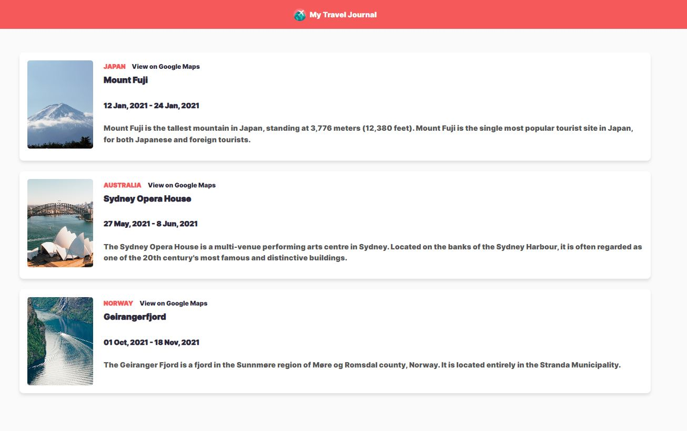

# **Travel Journal Project**

A visually appealing and functional React application that showcases travel destinations with key details like location, dates, and descriptions. Built to practice and demonstrate concepts like props, mapping components, and dynamic rendering.

---

## **Features**

- 📍 Displays travel journal entries dynamically using React components.
- 🗺️ Includes location links to Google Maps for easy navigation.
- 🎨 Responsive design with clean and modern styling.
- 🔑 Utilizes key React concepts like props, object spreading, and `.map()`.
- 🏗️ Built with Vite for a fast development experience.

---

## **Technologies Used**

- **React**: Component-based UI library.
- **CSS**: For styling the layout and visuals.
- **Vite**: Fast build tool for modern web development.

---

## **Preview**

### **Screenshot**

Below is a preview of the Travel Journal Project:

